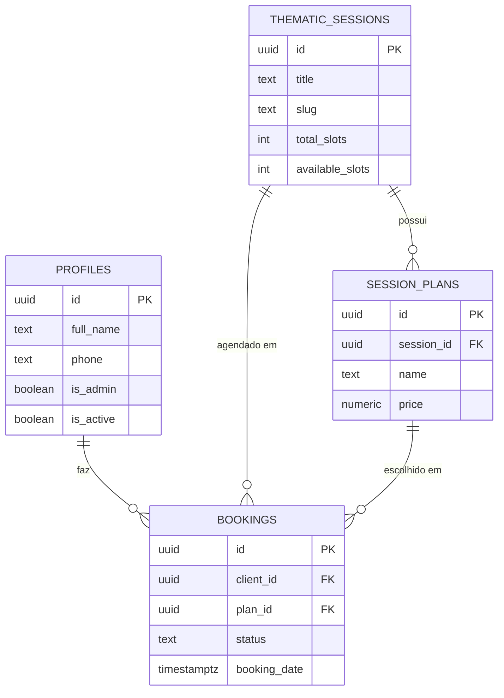

# Documentação do Banco de Dados - Um Mais Um Fotos

Este documento descreve a estrutura do banco de dados (PostgreSQL) gerenciado pelo Supabase, incluindo tabelas, colunas, relacionamentos e políticas de segurança (RLS).

## 📊 Diagrama de Entidades (Simplificado)

## 🗃️ Tabelas

### 1. `profiles`
Extensão da tabela `auth.users` do Supabase para armazenar dados adicionais dos usuários.
- **`id`**: `UUID` (PK, referência a `auth.users`).
- **`full_name`**: `TEXT` - Nome completo do cliente.
- **`phone`**: `TEXT` (Unique) - Telefone para login via WhatsApp.
- **`is_admin`**: `BOOLEAN` - Define se o usuário tem acesso ao painel administrativo.
- **`is_active`**: `BOOLEAN` - Estado da conta do cliente.

### 2. `thematic_sessions`
Armazena os ensaios temáticos (ex: Natal, Dia das Mães).
- **`id`**: `UUID` (PK).
- **`title`**: `TEXT` - Nome do ensaio.
- **`slug`**: `TEXT` (Unique) - URL amigável.
- **`cover_image_url`**: `TEXT` - Foto de capa (exibida nos cards).
- **`highlight_images`**: `TEXT[]` - Galeria de amostras ("O que está rolando").
- **`total_slots`**: `INTEGER` - Total de vagas abertas.
- **`available_slots`**: `INTEGER` - Vagas restantes.
- **`is_active`**: `BOOLEAN` - Se o ensaio está visível no site.

### 3. `session_plans`
Diferentes pacotes de preços para cada ensaio temático.
- **`id`**: `UUID` (PK).
- **`session_id`**: `UUID` (FK -> `thematic_sessions.id`).
- **`name`**: `TEXT` - Nome do plano (ex: Bronze, Ouro).
- **`price`**: `NUMERIC` - Valor do investimento.
- **`photo_quantity`**: `INTEGER` - Quantidade de fotos inclusas.

### 4. `bookings` (Agendamentos)
Registra as reservas feitas pelos clientes.
- **`id`**: `UUID` (PK).
- **`client_id`**: `UUID` (FK -> `profiles.id`).
- **`plan_id`**: `UUID` (FK -> `session_plans.id`).
- **`status`**: `TEXT` - `pendente`, `confirmado`, `fotografado`, `disponibilizado`.
- **`booking_date`**: `TIMESTAMPTZ` - Data e hora agendada.

### 5. `audit_logs` (Segurança)
Registra todas as alterações feitas em tabelas críticas para fins de auditoria.
- **`id`**: `UUID` (PK).
- **`table_name`**: `TEXT` - Nome da tabela alterada.
- **`record_id`**: `TEXT` - ID do registro alterado.
- **`action`**: `TEXT` - Tipo da ação (`INSERT`, `UPDATE`, `DELETE`).
- **`old_data`**: `JSONB` - Estado do registro antes da alteração.
- **`new_data`**: `JSONB` - Estado do registro após a alteração.
- **`changed_by`**: `UUID` (FK -> `profiles.id`) - Quem realizou a ação.

### 6. `landing_content`
Armazena o conteúdo dinâmico da Home (Hero, Sobre, Contato).
- **`key`**: `TEXT` (PK) - Chave identificadora (ex: 'contact').
- **`content`**: `JSONB` - Objeto com os campos de texto e imagens.

---

## 🔐 Segurança (Row Level Security - RLS)

O projeto adota uma postura de segurança rigorosa onde o acesso é negado por padrão.

| Tabela | Leitura (Select) | Escrita (Insert/Update/Delete) |
| :--- | :--- | :--- |
| `profiles` | O próprio usuário ou Admin | Somente Admin |
| `thematic_sessions` | Público (se `is_active=true`) | Somente Admin |
| `session_plans` | Público | Somente Admin |
| `bookings` | O próprio cliente ou Admin | Cliente (Insert) / Admin (All) |
| `audit_logs` | Somente Admin | Sistema (Triggers) |
| `landing_content` | Público | Somente Admin |

---

## 🛠️ Migrações e Versão
As definições de schema são versionadas em `src/utils/supabase/migrations/`.
Atualmente no nível: `007_user_management_and_bookings.sql`.

---
*Documentação gerada e mantida por @documentation-writer*
